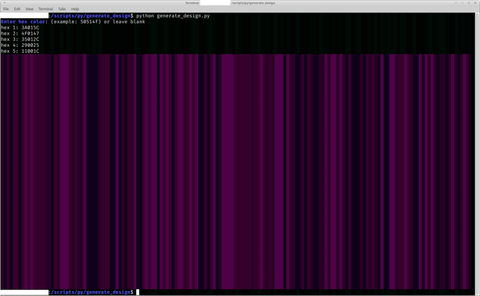

# generate_random_design_nick3499
Generate random design which displays in terminal emulator



## Unix Shebang

The human-readable Unix shebang `#!` translates to the magic number `0x23 0x21`. Based on the shebang line `#!/usr/bin/env python`, the `env` shell command interprets the `generate_design.py` text file as a Python app.

```python
>>> hex(ord('#'))
'0x23'
>>> hex(ord('!'))
'0x21'
```

## Documentation

```python
>>> __doc__
'Generate random colored background.\nref. https://coolors.co/020202-0d2818-04471c-058c42-16db65'
>>> generate_design.__doc__
'Generate random background design.'
```

The `__doc__` string contains the module's documentation, while the `generate_design.__doc__` string contains the function's documentation.

## Import

```python
from random import randrange
```

The `random.randrange()` method is used to generate a random number from 1 to 5, in order to randomly select one color from the scheme.

## function

```python
def generate_design():
```

The block keyword `def` starts the definition and organization of the function's code; the `generate_design()` method's code block.

## Inputs

```python
print('\x1b[1;34mEnter hex color\x1b[0m: (example: 50514f) or leave blank')

hex1 = input('hex 1: ').upper()
hex2 = input('hex 2: ').upper()
hex3 = input('hex 3: ').upper()
hex4 = input('hex 4: ').upper()
hex5 = input('hex 5: ').upper()
```

The `input()` builtin function returns a prompt for user input. The following is an example of such input:

```shell
Enter hex color: (example: 50514f) or leave blank
hex 1: 020202
hex 2: 0d2818
hex 3: 04471c
hex 4: 058c42
hex 5: 16db65
```

## Split Hex Code to Pairs

```python
hex_pairs = {
    'p1': [hex1[:2], hex1[2:4], hex1[4:]],
    'p2': [hex2[:2], hex2[2:4], hex2[4:]],
    'p3': [hex3[:2], hex3[2:4], hex3[4:]],
    'p4': [hex4[:2], hex4[2:4], hex4[4:]],
    'p5': [hex5[:2], hex5[2:4], hex5[4:]]}
ascii_nums = []
```

For example, the hex color code `'058c42'` splits to `['05', '8c', '42']` using slice notation. For example, `hex4[2:4]` slices the two middle alphanumeric characters `'8c'` out of `'058c42'`. 

## Convert to ASCII

```python
for i in hex_pairs:
    try:
        ascii_list = [
            int(hex_pairs[i][0], 16),
            int(hex_pairs[i][1], 16),
            int(hex_pairs[i][2], 16)]
        ascii_nums.append(ascii_list)
    except ValueError:
        ascii_nums.append([0, 0, 0])
```

Next, the hex pairs are converted to decimal numbers, as demonstrated below:

```python
>>> int('05', 16)
5
>>> int('8c', 16)
140
>>> int('42', 16)
66
```

The `try` statement is mainly there to catch and handle a `ValueError` when the user leaves an input blank, which defaults to `[0, 0, 0]` or pitch black basically. For example, if the user enters nothing but empty strings, then the generated design becomes a big black rectangle. But that can be a way to test the script, before trying real hex color codes.

## Generate Design

```python
color_pattern = ''
colors = [
    f'\x1b[48;2;{ascii_nums[0][0]};{ascii_nums[0][1]};{ascii_nums[0][2]}m \x1b[0m',
    f'\x1b[48;2;{ascii_nums[1][0]};{ascii_nums[1][1]};{ascii_nums[1][2]}m \x1b[0m',
    f'\x1b[48;2;{ascii_nums[2][0]};{ascii_nums[2][1]};{ascii_nums[2][2]}m \x1b[0m',
    f'\x1b[48;2;{ascii_nums[3][0]};{ascii_nums[3][1]};{ascii_nums[3][2]}m \x1b[0m',
    f'\x1b[48;2;{ascii_nums[4][0]};{ascii_nums[4][1]};{ascii_nums[4][2]}m \x1b[0m']

for i in range(0, 160):
    color_pattern += colors[randrange(1, 5)]

for i in range(0, 40):
    print(color_pattern)
```

The f-string `f'\x1b[48;2;{ascii_nums[0][0]};{ascii_nums[0][1]};{ascii_nums[0][2]}m \x1b[0m'` background color formats a single space. The sequence `48;2;` is for background color modification, followed by `13;40;24`, which sets RGB values, for example.

The first `for` loop interates the `color_pattern += colors[randrange(1, 5)]` instruction which appends a random background-color space to the `color_pattern` attribute. The `randrange(1, 5)` call returns an integer from 1 to 5 which is used to pick a random color index.

The second `for` loop simply repeats the generated random pattern stored in `color_pattern` to the extent of 40 identical lines.

## If Block

```python
if __name__ == '__main__':
    generate_design()
```

The final `if` block executes the `generate_design()` method of the script runs as a standalone app. For example, if this app was imported into another app, its `__name__` would no longer be `__main__`, so `generate_design()` would not execute unless it was called.

